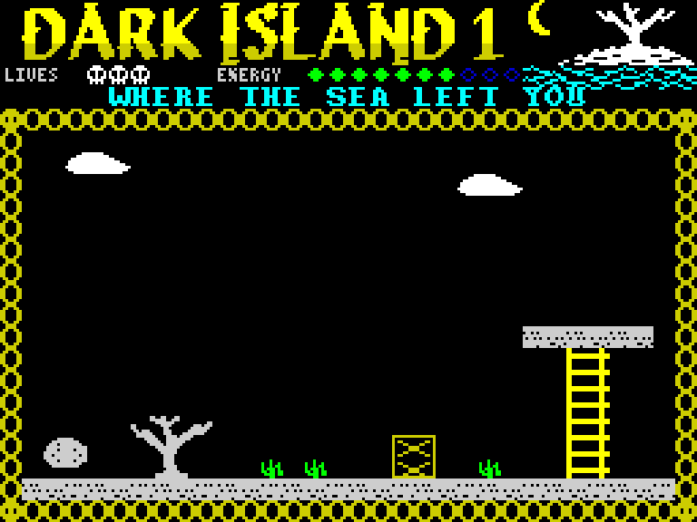
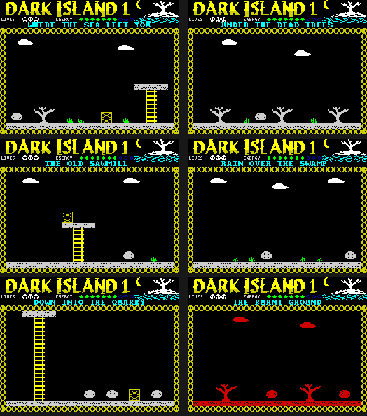
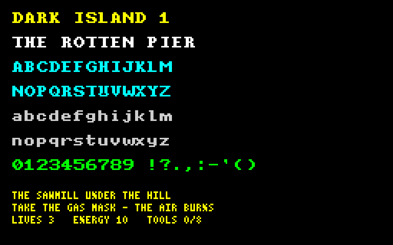

# DARK ISLAND 1

A ZX Spectrum 128 game in Z80 assembly, built with SjASMPlus.

Like *Dillen* next door, this one is nostalgia: the whole island is drawn on one
sheet of squared paper that its author filled in as a boy, and that sheet is in
this repository as [`gfx/dark.island.1-map.gif`](gfx/dark.island.1-map.gif).
Every room, every ladder, every tool and every trap of the game is on it, in
blue ballpoint, in Slovak. This project is the attempt to finally build it.



## The story

The storm took the mast somewhere in the small hours, and the sea took the rest.

You wake up on a shore that is on no chart you have ever seen: black rock, hard
grass, dead trees the salt has stripped bare, and a sky that carries rain in
every single cloud. Behind you, what is left of your boat lies on the stones.
It can be mended. You have been mending boats your whole life. That is not the
problem.

The problem is that you came ashore with exactly two things: the clothes you
stand in, and **one thousand dollars** in a wet pocket. On Dark Island a
thousand dollars buys nothing at all - there is no shop, no harbour, no one to
sell you passage. What the island has instead is **tools**, and every one of
them is somewhere it does not want to be.

There is an old **sawmill** in the middle of the island and a man in it who owns
the only **saw**. Further on, a man with a **screwdriver** sits where the glue
is kept, and high on the eastern ladders there is a man with **pliers** who has
not spoken to anybody in years. None of the three will simply hand a tool over.
One wants the money. One wants something carried up to him. One wants a favour
that costs you a life if you get it wrong.

And the island does not want you to finish. Behind the sawmill the ground is
still burning from a fire nobody remembers lighting, and the air over it will
kill you in seconds unless you find the **gas mask** first - which is why the
mask is drawn in the very first room of the map, and why the arrow next to the
burning ground says *POZOR: ZAHORENÉ PROSTREDIE*. Water drips out of the clouds
onto everything that must stay dry. In the tunnel that leads down to the
**toolbox** a **guillotine** hangs over the passage, and it does not always fall
when you expect it.

Fill the toolbox. Mend the boat. Get off Dark Island.

Then look at the number after the name, and understand that there is another
island after this one.

## What you have to find

Everything in this list is written on the paper map, in the room it belongs to:

| The tool | Where the map puts it |
| --- | --- |
| Gas mask (*plynová maska*) | the first room, over the shore |
| Wood (*drevo*) | by the man with the saw |
| Saw (*pílka*) | the man in the sawmill |
| Bucket of water (*vedro s vodou*) | the upper level, next to the nails |
| Nails (*klince*) | the far end of the upper level |
| Screwdriver (*šróbovák*) | the man on the middle level |
| Glue (*lepidlo*) | over the middle level, above the hammer |
| Hammer (*kladivo*) | the middle level |
| Pliers (*kliešte*) | the man on the eastern ladders |
| Adhesive tape (*lepiaca páska*) | the lower level, under the rain |
| Toolbox (*krabička na náradie*) | the bottom of the island, past the guillotine |

And in your pocket, from the first frame to the last: **1000 $**.

## What is in the game so far

This is the beginning: the screen of the game, running.

- **The panel** takes the first five character rows. It carries the blackletter
  name of the game, a small picture of the island - the moon, the dead tree on
  the rock, the sea under it - the lives of the castaway as skulls, his energy
  as a row of stones, and the name of the room he stands in.
- **The game field** is the 30x17 characters under it, inside the rope border.
  This is where the rooms of the map are drawn.
- **Six rooms** of the island are laid out already, so the field, the map and
  the panel can be walked through and seen working.



The castaway himself, the tools, the three men and the guillotine are not in it
yet.

## The gothic hand

The game is written in two fonts of its own, both drawn in this repository.



The **logo** is real blackletter: `tools/logo_alphabet.py` holds every letter of
it as a list of pen strokes, and `tools/pen.py` drags a broad nib along them at
thirty degrees. That is how gothic letters were actually made - a stroke pulled
down leaves a heavy stem with a slanted head and foot, a stroke pulled up to the
right leaves a hairline - so the weight of the letters falls where a scribe
would have put it, and not where a mouse would.

The **game font** is eight by eight, because that is all a character of the
screen has. True blackletter turns to mud at that size, so it is a heavy
medieval hand instead: two pixel stems, bars where a roman letter has serifs and
no round corner anywhere. The name of the room in the panel is written with it.

Next to those two there is a **small font** of three by five, where two
characters fit into one character of the screen. The words LIVES and ENERGY in
the panel are set in it, and it is waiting in the game for the longer texts that
are still to come.

## Build

```powershell
sjasmplus -Isrc src/main.asm     # run from this directory
```

`build.bat` runs the same command, `build_and_run.bat` builds and opens the
snapshot in SpecEmu, and `build.sh` / `build_and_run.sh` do it through Wine.
The assembler is SjASMPlus 1.23.1.

A successful build writes two files that are not kept in git:

- `DarkIsland1.sna` - a snapshot, load it straight into an emulator;
- `DarkIsland1.tap` - a self-starting tape. Load it with `LOAD ""`, its one line
  of BASIC does the rest.

## Controls

The castaway cannot walk yet, so until he can, these keys move the world around
him:

| Keys | What they do |
| --- | --- |
| Caps Shift + cursor keys | walk from room to room over the map of the island |
| `A` / `S` | take one point of energy away, give one back |
| `D` | take a whole life |
| `F` | give a life back |

## The artwork is generated

Nothing in `src/font_8x8.asm`, `src/font_4x8.asm`, `src/game_panel_picture.asm`
or `src/sprites_land.asm` is written by hand - those four files are output. The
scripts that make them need Pillow and are run from this directory:

```powershell
py -3 tools/generate_font.py      # the two fonts       -> gfx/fonts.png
py -3 tools/generate_panel.py     # the panel picture   -> gfx/panel.png
py -3 tools/generate_sprites.py   # the room sprites    -> gfx/sprites.png
py -3 tools/preview_screen.py     # the whole screen    -> gfx/screen.png
```

The last one is worth knowing about: it reads the border out of
`src/game_field.asm` and the rooms out of `src/rooms.asm` and draws the screen
the Spectrum would draw, so a sprite in the wrong place shows up in a PNG
instead of on the television. It also measures every sprite of every room
against the walls of the field and complains about anything hanging out.

## What comes next

The castaway and his walk. The eleven tools and what you carry them in. The
three men who own the good ones. The rain, the fire and the guillotine. Music.

*We are doing something for Speccy again ;)*

## Compiler

SjASMPlus - Z80 Assembly Cross-Compiler
[http://sourceforge.net/projects/sjasmplus/](http://sourceforge.net/projects/sjasmplus/)

1. Download it
2. Unpack it somewhere
3. Add its folder to your system PATH
4. Then you can compile
